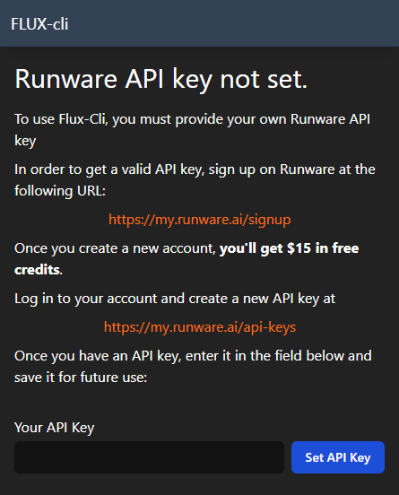
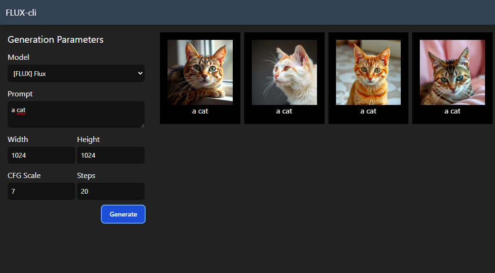

# Flux-cli

A simple UI to perform calls to Runware ™ API, made on React and Runware SDK

## Installation

Clone this repo:

`git clone https://github.com/ramen-soft/flux-cli.git`

Install dependencies:

`npm install`

Run Flux-cli in Dev Mode:

`npm run dev`

## Getting started

The first time you run Flux-cli, it will prompt you for a Runware ™ API key:

You can obtain it by signing up for Runware through this link:

https://my.runware.ai/signup

Once signed up and logged in, you can create your API key at:

https://my.runware.ai/api-keys

Enter the API key in the field provided by Flux-cli.

Now you're ready to generate images!

